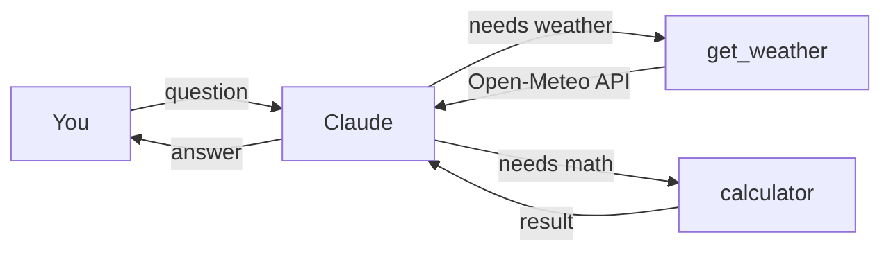

# Weather Look Up and Calculator API


A small command-line chat agent built on the Claude API. Ask it anything in plain English, and Claude decides when to call one of two tools:

| Tool | What it does | Data source |
| --- | --- | --- |
| `get_weather` | Current temperature for any city, in °C and °F | [Open-Meteo](https://open-meteo.com) (free, no key needed) |
| `calculator` | Safely solves math like `17 * 0.4` or `(3 + 5) ** 2` | Built in, no `eval()` |

## Example

```text
Weather + Calculator agent. Type 'exit' to quit.

you > What's the weather in Chicago, and what's 15% of 84?
  [calling tool: get_weather({'location': 'Chicago'})]
  [calling tool: calculator({'expression': '84 * 0.15'})]
claude > It's currently 18.2°C (64.8°F) in Chicago, and 15% of 84 is 12.6.
```

## How it works



1. Your message goes to Claude along with a description of both tools.
2. Claude picks which tool (if any) it needs and what to pass in.
3. The tool runs on your machine and sends the result back to Claude.
4. Claude uses the result to write the final answer.

The loop is handled by the Anthropic SDK's `tool_runner`, and the tools are plain Python functions marked with `@beta_tool`.

### Why the calculator is safe

Python's `eval()` would run any code it's given. Instead, the calculator parses the expression into a syntax tree and only allows `+`, `-`, `*`, `/`, `**` and negative numbers. Anything else is rejected.

## Setup

You'll need Python 3.9+ and an [Anthropic API key](https://console.anthropic.com/).

```bash
git clone https://github.com/ryanalim24434/weather-look-up-and-Calculator-API.git
cd weather-look-up-and-Calculator-API

python3 -m venv .venv
source .venv/bin/activate
pip install -r requirements.txt

export ANTHROPIC_API_KEY=your-key-here
python agent.py
```

Type `exit` or `quit` to leave.

## Project structure

```text
agent.py           the agent and both tools
requirements.txt   Python packages to install
.env.example       where your API key goes
```

## License

[MIT](LICENSE)
